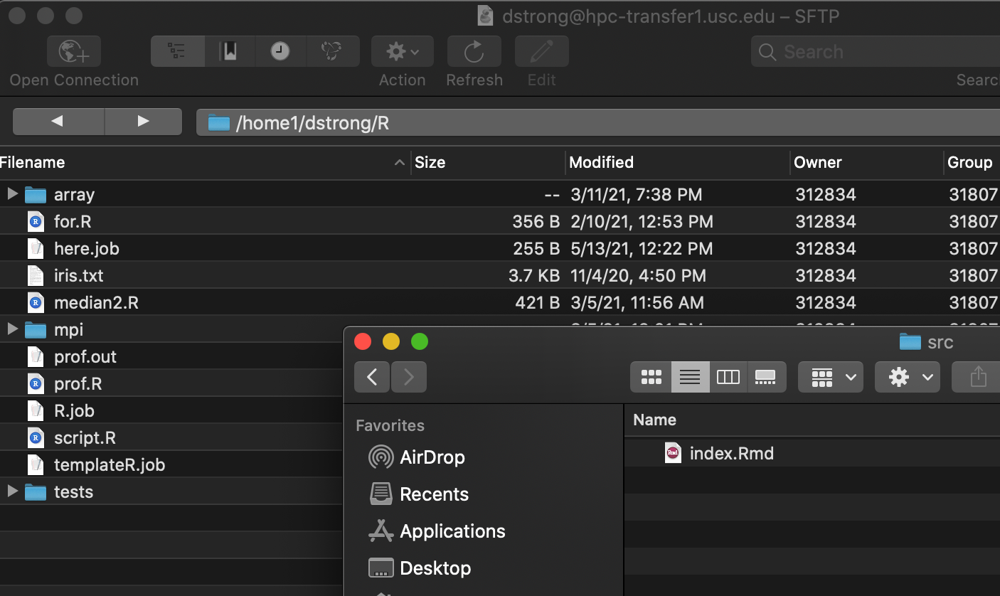
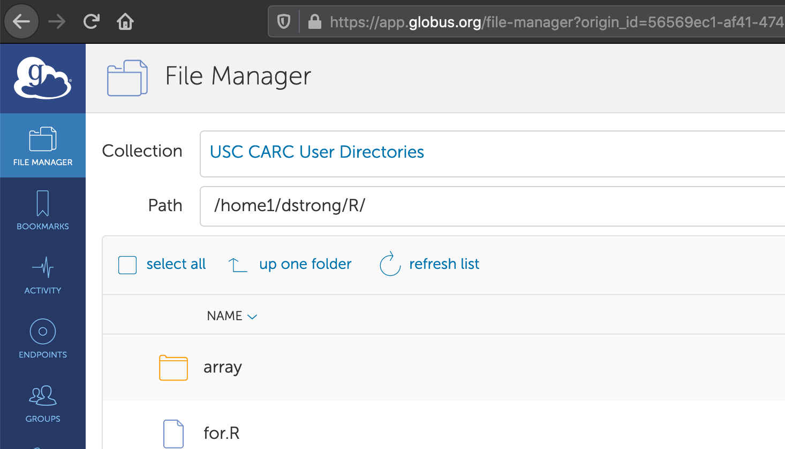

## Outline

1 - Storage file systems  
2 - Managing files  
3 - Transferring files


## 1 - Storage file systems

[CARC User Guide for Storage File Systems](https://carc.usc.edu/user-information/user-guides/data-management/storage-file-systems)


## Overview of file systems

| File system | Recommended storage | Recommended activities |
|---|---|---|
| /home1 | personal files, configuration files, software | creating scripts/programs, installing software |
| /project | shared files, software, job scripts, I/O files | creating scripts/programs, installing software, I/O, transferring data |
| /scratch & /scratch2 | temporary and I/O files | I/O, testing |

<br>

- Mounted on both the Discovery and Endeavour clusters
- Run BeeGFS/ZFS, and files are automatically compressed (on the fly)
- Do not support sensitive data (HIPAA, FERPA, etc.)
- Check your directories and usage with `myquota`


## myquota

```
ttrojan@discovery1:~$ myquota
--------------------------
/home1/ttrojan
      user/group     ||           size          ||    chunk files    
     name     |  id  ||    used    |    hard    ||  used   |  hard   
--------------|------||------------|------------||---------|---------
       ttrojan|555555||  127.23 MiB|  100.00 GiB||     4530|  2000000

--------------------------
/scratch/ttrojan
      user/group     ||           size          ||    chunk files    
     name     |  id  ||    used    |    hard    ||  used   |  hard   
--------------|------||------------|------------||---------|---------
       ttrojan|555555||  446.78 MiB|   10.00 TiB||     5797|unlimited

--------------------------
/scratch2/ttrojan
      user/group     ||           size          ||    chunk files    
     name     |  id  ||    used    |    hard    ||  used   |  hard   
--------------|------||------------|------------||---------|---------
       ttrojan|555555||  200.34 MiB|   10.00 TiB||     4002|unlimited

--------------------------
/project/ttrojan_123
      user/group     ||           size          ||    chunk files
     name     |  id  ||    used    |    hard    ||  used   |  hard
--------------|------||------------|------------||---------|---------
   ttrojan_123| 55555||   16.92 GiB|    5.00 TiB||     1134| 30000000
```


## Home file system

- `/home1/<username>`
- Personal directories
  - Default directory when logging in
  - Personal and configuration files
  - Software
- Quota: 100 GB / 2 M files
- File recovery with daily snapshots and a two-week window
- Use `cd` to quickly change to your home directory


## Project file system

- `/project/<PI_username>_<id>`
- High-performance, parallel I/O file system
- Group directories
  - Project files
  - Share data, software, and other files among group members
- Quota: Variable TB / 30 M files
  - 5 TB default
  - 10 TB free per PI across projects
  - After that, $40/TB/year
- File recovery with daily snapshots and a two-week window


## Project file system (continued)

- Create alias to quickly change to project directories
  - `alias cdp=“cd /project/ttrojan_123”`
  - Add to `~/.bashrc` to automatically set when logging in
- By default, all files have read/write permissions for owner and group members
  - If needed, permissions can be changed to restrict access
  - Use `chmod`


## Scratch file systems

- `/scratch/<username>`
- `/scratch2/<username>`
- High-performance, parallel I/O file systems
- Quota: 10 TB each
- No file recovery
- Use `cds` and `cds2` commands to quickly change to those directories


## Using /tmp space

- Local `/tmp` directories on compute nodes are restricted to 1 GB of RAM space, shared among jobs running on the same node
- These can become full and are cleared (which can kill jobs)
- Define temporary directories in your /scratch or /project directories
- Redirect temporary files created in the background by programs
- Set the `TMPDIR` environment variable:

```
mkdir /scratch/<username>/tmp
export TMPDIR=/scratch/<username>/tmp
```

- Add the export line to your `~/.bashrc` to automatically set this variable when logging in


## Exercise 1

Create an alias command for changing to your project directory


## 2 - Managing files

[CARC User Guide for Managing Files](https://carc.usc.edu/user-information/user-guides/data-management/managing-files)


## Some example management tasks

- Organizing files
- Sharing files
- Archiving and compressing files


## A note on data management plans

- Have a project data management plan
- Review the literature for best practices in your discipline


## Organizing files

- `ls` to list files
- `mkdir` to make new diretories
- `mv` to move or rename files
- `cp` to copy files
- `rm` to delete files
- Could also use GUI SFTP clients to perform these tasks (more later)


## Exercise 2

Move a file from one directory to another


## Checking file disk usage

- Use `du` to check disk usage
- To list the ten largest files or subdirectories in the current directory:

```
du -s * | sort -nr | head -n 10
```

- Remember ZFS compresses files, so for uncompressed file sizes:
  - Use `du -sh --apparent-size`
  - Alternatively, use `ls -lh`


## A note on file permissions

- On Linux, files have read (r), write (w), and execute (x) permissions
- There are separate permissions for the owner, group, and other users
- A file with `-rwx------` permissions gives the owner full permissions but all other users no permissions
- A file with `-rwxrwx---` permissions gives the owner and group full permissions but other users no permissions
- Read and execute permissions are needed to access directories
- Only the owner (or sysadmin) can change file permissions


## Sharing files

- Project directories are meant for sharing files
- Use `chmod` to modify file permissions if needed
- For example, to provide read-only access for group members to a subdirectory:

```
chmod 750 /project/ttrojan_123/dir
```

- To check permissions, use `ls -l` to list files and their permissions


## Archiving files

- Use `tar` to create an archive file from a set of files or directories:

```
tar -cvf project.tar <dir>
```

- Add the `--remove-files` option to also delete the files
- To list contents of an archive file, use the `-t` option:

```
tar -tvf project.tar
```

- To extract an archive file, use the `-x` option:

```
tar -xvf project.tar
```


## Compressing files

- Compression/uncompression tools
  - `gzip` or `pigz`
  - `xz`
- For large data, can be useful to compress before transferring files (more later)
- Some files not worth compressing (already compressed files, media files, small files)
- To compress with `xz` using multiple cores:

```
xz -v -T4 dataset.csv
```

- To uncompress with `xz` using multiple cores:

```
xz -dv -T4 dataset.csv.xz
```


## Exercise 3

Compress and uncompress a file


## Archiving and compressing files

- Can also archive and compress directly with `tar`
- To archive and compress (using `gzip`):

```
tar -czvf project.tar.gz <dir>
```

- To uncompress and extract:

```
tar -xvf project.tar.gz
```


## Long-term archival storage

- [USC Digital Repository](https://repository.usc.edu/)
- [AWS Glacier](https://aws.amazon.com/glacier/)
- Research data repositories (e.g., OSF, Zenodo, Harvard Dataverse, Dryad, etc.)


## 3 - Transferring files

[CARC User Guide for Transferring Files](https://carc.usc.edu/user-information/user-guides/data-management/transfer-overview)


## Data transfer nodes

- Two dedicated, high-speed data transfer nodes
- hpc-transfer1.usc.edu
- hpc-transfer2.usc.edu
- 100 Gbps connectivity
- Note: Compute nodes do not have internet access


## Overview of tools

- Many secure file transfer tools
- Choice depends on preference and type of transfer
- Local &rlarr; CARC systems
  - GUI: Cyberduck, FileZilla, WinSCP, MobaXterm, Globus
  - CLI: `sftp`, `scp`, `rsync`, `globus-cli`, `aspera-cli`
- CARC systems &rlarr; Internet
  - CLI: `sftp`, `lftp`, `rclone`, `wget`, `curl`, `aria2c`, `git`


## Some example scenarios

| System 1 | System 2 | Recommended Method |
|---|---|---|---|
| Personal computer | CARC file system for small-medium transfers | GUI, CLI |
| Personal computer | CARC file system for large or encrypted transfers | Globus |
| Amazon Web Services (AWS) | CARC file system | CLI |
| Other HPC center | CARC file system | Globus |


## General recommendations

- Only transfer data that is necessary
- Compress large files using `xz` to reduce size of transfer (depending on network speed)
- Archive files using `tar` when transferring large numbers of files (and compress)
- For large transfers to/from your local computer or other endpoint, use Globus
- File sizes and network speed determine what is considered a large transfer


## Graphical transfer tools

- Drag and drop files to transfer between local computer and CARC systems
- A few options for SFTP GUI clients:
  - Cyberduck
  - FileZilla
  - WinSCP
  - MobaXterm
- Can also use Globus web GUI
- [CARC User Guide for Transferring Files using a GUI](https://carc.usc.edu/user-information/user-guides/data-management/transferring-files-gui)


## Cyberduck interface




## Command-line transfer tools

- Many options depending on type of transfer

| Scenario | Options |
|---|---|
| Local &rlarr; CARC systems | `sftp`, `scp`, `rsync`, `globus-cli`, `aspera-cli` |
| CARC systems &rlarr; Internet | *File servers*: `sftp`, `lftp` <br> *Downloads*: `wget`, `curl`, `aria2c` <br> *Cloud storage*: `rclone` <br> *Code*: `git` |


## CLI recommendations

- For small-to-medium transfers to/from your local computer, use `sftp` or `rsync`
- For large transfers to/from your local computer or other endpoint, use `globus-cli`
- For transfers to/from an FTP server, use `lftp`
- For faster internet downloads, use `aria2c`
- For transfers to/from cloud storage, use `rclone`
- For backing up and syncing directories, use `rsync` or `rclone`
- [CARC User Guide for Transferring Files using a CLI](https://carc.usc.edu/user-information/user-guides/data-management/transferring-files-command-line)


## sftp example

```
$ sftp ttrojan@hpc-transfer1.usc.edu
Duo two-factor login for ttrojan

Enter a passcode or select one of the following options:

 1. Duo Push to XXX-XXX-5555
 2. Phone call to XXX-XXX-5555
 3. SMS passcodes to XXX-XXX-5555

Passcode or option (1-3): 1
Connected to hpc-transfer1.usc.edu.
sftp> lpwd
Local working directory: /home/tommy
sftp> lcd myimages
sftp> lls
myplot1.jpg myplot2.jpg
sftp> pwd
Remote working directory: /home1/ttrojan
sftp> cd /scratch/ttrojan/images
sftp> put myplot1.jpg myplot.jpg
Uploading myplot1.jpg to /scratch/ttrojan/myplot.jpg
myplot1.jpg                                 100%   10KB   2.4MB/s   00:01    
sftp> get myplot3.jpg myplot3.jpg
Fetching /scratch/ttrojan/myplot3.jpg to myplot3.jpg
/scratch/ttrojan/myplot3.jpg                100%   10KB   2.4MB/s   00:01  
```


## rsync example

- Structure of command: `rsync [options] <source> <destination>`
- To upload a directory:

```
$ rsync -avh ~/data ttrojan@hpc-transfer1.usc.edu:/project/ttrojan_123
Duo two-factor login for ttrojan

Enter a passcode or select one of the following options:

 1. Duo Push to XXX-XXX-5555
 2. Phone call to XXX-XXX-5555
 3. SMS passcodes to XXX-XXX-5555

Passcode or option (1-3): 1
sending incremental file list
data/
data/data1.csv
data/data2.csv
data/data3.csv

sent 7,165,979 bytes  received 153 bytes  196,332.38 bytes/sec
total size is 7,163,626  speedup is 1.00
```


## Exercise 4

Upload a file from your local computer to one of your CARC directories


## wget example

- Use `wget` for simple downloads

```
$ wget https://julialang-s3.julialang.org/bin/linux/x64/1.6/julia-1.6.1-linux-x86_64.tar.gz
--2021-06-03 11:34:06--  https://julialang-s3.julialang.org/bin/linux/x64/1.6/julia-1.6.1-linux-x86_64.tar.gz
Resolving julialang-s3.julialang.org (julialang-s3.julialang.org)... 151.101.198.49, 2a04:4e42:2e::561
Connecting to julialang-s3.julialang.org (julialang-s3.julialang.org)|151.101.198.49|:443... connected.
HTTP request sent, awaiting response... 200 OK
Length: 112784227 (108M) [binary/octet-stream]
Saving to: ‘julia-1.6.1-linux-x86_64.tar.gz’

100%[==================================================>] 112,784,227  378MB/s   in 0.3s

2021-06-03 11:34:06 (378 MB/s) - ‘julia-1.6.1-linux-x86_64.tar.gz’ saved [112784227/112784227]
```


## A note on aria2c

- `aria2c` allows multi-connection and concurrent downloads
- To download with multiple connections:

```
aria2c -x4 <url>
```

- To download multiple files concurrently (list of URLs in text file):

```
aria2c -j4 -i urls.txt
```


## Exercise 5

Download a file from the internet to one of your CARC directories


## A note on Rclone

- `module load rclone`
- Similar to `rsync`, but for transferring files to/from cloud storage services
- Requires configuration
- [CARC User Guide for Rclone](https://carc.usc.edu/user-information/user-guides/data-management/transferring-files-rclone)


## Globus service

- For large, long-running transfers
- Ability to pause and restart transfers and sync directories
- Can also be used to share data between external collaborators or data providers
- Web GUI or CLI
- [CARC User Guide for Globus](https://carc.usc.edu/user-information/user-guides/data-management/transferring-files-globus)


## Globus interface




## Backing up files

- For local storage (e.g., external drive), use `rsync` or Globus
- For cloud storage, use `rclone`
- Can also use research data repositories (e.g., OSF, Zenodo, Harvard Dataverse, Dryad, etc.)
- Create aliases or shell scripts to help automate backups


## Sharing files externally

- Can use Globus or cloud storage
- With Globus, submit a support ticket and we will help you set it up
- With cloud storage, use `rclone` to sync a directory and then share with cloud storage sharing features


## Additional resources

- [CARC User Guides for Data Management](https://carc.usc.edu/user-information/user-guides/data-management)
- Video learning
  - [SFTP GUI clients](https://carc.usc.edu/education-and-outreach/video-learning/data-management-guis)
  - [CLI tools and Globus](https://carc.usc.edu/education-and-outreach/video-learning/data-management-cli-globus)


## Getting help

- [Submit a support ticket](https://carc.usc.edu/user-information/ticket-submission)
- [User Forum](https://hpc-discourse.usc.edu/)
- Office Hours
  - Every Tuesday 2:30-5pm (currently via Zoom)
  - Register [here](https://carc.usc.edu/news-and-events/events)
